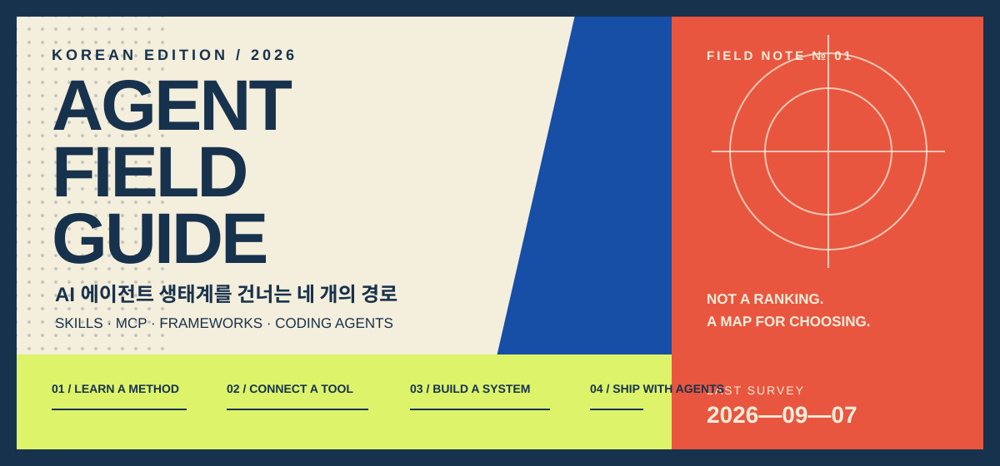
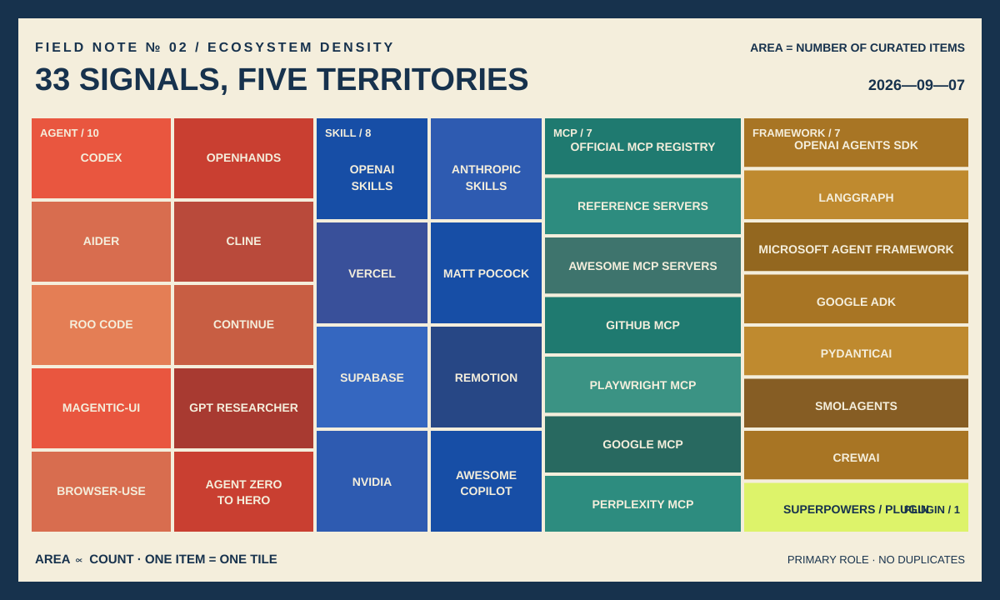

<p align="center">
  
</p>

# AI 에이전트 필드 가이드

<p>
  <strong>링크를 모은 목록이 아니라, 지금 나에게 필요한 도구를 고르는 지도.</strong><br>
  Claude Code와 Codex 사용자, 에이전트 개발 입문자, 교육자를 위한 한국어 큐레이션입니다.
</p>

<p>
  <a href="#route-01--일하는-방법을-배우기">01 SKILLS</a>　·　
  <a href="#route-02--외부-도구와-연결하기">02 MCP</a>　·　
  <a href="#route-03--에이전트-시스템-만들기">03 FRAMEWORKS</a>　·　
  <a href="#route-04--완성형-에이전트로-출발하기">04 AGENTS</a>
</p>

> **FIELD NOTE № 01**　마지막 현장 조사 `2026-09-07`<br>
> 프로젝트 상태와 설치법은 변합니다. 이 가이드는 순위표가 아니며, 공식성·학습 가치·실습 가능성을 기준으로 선별합니다.

## 출발점: 당신은 지금 어디에 있나요?

| | 목적 | 첫 번째 좌표 |
| :---: | --- | --- |
| **01** | 에이전트가 일을 더 꼼꼼하게 하길 원한다 | [OpenAI Skills](https://github.com/openai/skills) 또는 [Anthropic Skills](https://github.com/anthropics/skills)에서 하나만 골라 구조를 읽어 보세요. |
| **02** | GitHub·브라우저·DB를 직접 다루게 하고 싶다 | [공식 MCP Registry](https://registry.modelcontextprotocol.io/)에서 필요한 연결 하나를 찾으세요. |
| **03** | 상태와 분기가 있는 에이전트 앱을 만들고 싶다 | [OpenAI Agents SDK](https://github.com/openai/openai-agents-python)로 작은 도구 호출부터 시작하세요. |
| **04** | 지금 바로 코드 작업을 맡기고 싶다 | [Codex](https://github.com/openai/codex), [OpenHands](https://github.com/OpenHands/OpenHands), [Aider](https://github.com/Aider-AI/aider)를 작업 방식으로 비교하세요. |

### 10분 탐사 규칙

```text
하나만 고른다  →  원본 README를 읽는다  →  샘플에서 실행한다  →  증거로 검증한다
```

처음부터 스킬 열 개와 MCP 다섯 개를 설치하지 마세요. 도구가 많아지면 권한, 중복 이름, 컨텍스트 비용, 실패 지점도 함께 늘어납니다.

## 지도 범례

| 표식 | 무엇인가 | 기억할 문장 |
| --- | --- | --- |
| 🟥 **SKILL** | 반복 가능한 업무 절차가 담긴 `SKILL.md` 중심 폴더 | 일을 **어떻게** 할지 가르친다. |
| 🟦 **MCP** | 에이전트와 외부 도구·데이터를 연결하는 공개 규격 | 일할 **도구**를 연결한다. |
| 🟩 **PLUGIN** | 스킬·커넥터·MCP 설정을 설치 가능한 묶음으로 배포 | 기능을 **나눠 쓰기** 쉽게 만든다. |
| ⬛ **FRAMEWORK** | 상태, 분기, 도구 호출, 추적을 코드로 구현하는 개발 도구 | 에이전트 **시스템**을 만든다. |
| ◻️ **AGENT** | 설치해 바로 사용하는 코딩·조사 제품 | 완성된 **작업자**를 부른다. |

정확한 파일 구조와 필드는 [Agent Skills 공개 명세](https://agentskills.io/specification)를 기준으로 확인하세요.

## 현재 지도의 밀도

<p align="center">
  
</p>

<p align="center">
  <strong><a href="https://yunsell.github.io/ai-agent-skills-korean/">🗺️ 인터랙티브 지도 열기 — 타일을 눌러 33개 프로젝트 탐색하기</a></strong>
</p>

그래프의 면적은 이 README에 실린 **프로젝트·탐색 자원의 수**입니다. 공식 문서, 명세, 이 저장소 자체 링크는 제외하고 각 항목을 대표 역할에 한 번만 배정했습니다. Plugin 영역이 작은 것은 오류가 아니라 현재 큐레이션의 빈칸입니다. 다음 현장 조사의 우선순위이기도 합니다.

---

## ROUTE 01 / 일하는 방법을 배우기

> **목표:** 모델을 바꾸기 전에 작업 절차를 바꿔 결과의 일관성을 높입니다.

### 첫 관측 지점

| 프로젝트 | 지도상의 역할 | 이럴 때 선택 |
| --- | --- | --- |
| [OpenAI Skills](https://github.com/openai/skills) | **공식 카탈로그** | Codex에서 CI, PR, 보안, 문서 같은 단일 작업을 추가할 때 |
| [Anthropic Skills](https://github.com/anthropics/skills) | **공식 표본실** | 문서·디자인·개발 스킬의 구조를 해부해 보고 싶을 때 |
| [Superpowers](https://github.com/obra/superpowers) | **개발 방법론** | 기획 → 계획 → TDD → 디버깅 → 검증을 한 흐름으로 묶을 때 |
| [Vercel Agent Skills](https://github.com/vercel-labs/agent-skills) | **웹 전문 키트** | React·Next.js 성능과 인터페이스 품질을 점검할 때 |

### 작업 유형별 신호

- **요구사항이 흐리다** → 완료 조건, 제외 범위, 설계 대안을 먼저 적는 스킬
- **버그 원인을 모른다** → 재현, 증거, 가설, 최소 수정, 회귀 테스트 순서를 강제하는 스킬
- **결과를 믿기 어렵다** → 실제 테스트·로그·diff를 완료 조건으로 삼는 스킬
- **팀마다 방식이 다르다** → 프로젝트 명령과 리뷰 기준을 담은 저장소 전용 스킬

<details>
<summary><strong>관측 기록 펼치기 — 더 많은 스킬 저장소</strong></summary>

| 프로젝트 | 전문 영역 | 난이도 |
| --- | --- | :---: |
| [Matt Pocock Skills](https://github.com/mattpocock/skills) | 요구사항 인터뷰, PRD, 이슈 분해, 인수인계 | 중급 |
| [Supabase Agent Skills](https://github.com/supabase/agent-skills) | Supabase Auth, RLS, 마이그레이션, PostgreSQL 성능 | 중급 |
| [Remotion Skills](https://github.com/remotion-dev/skills) | React 기반 영상 구성과 렌더링 | 중급 |
| [NVIDIA Skills](https://github.com/nvidia/skills) | CUDA-X, Physical AI, 로보틱스, 시뮬레이션, RAG | 고급 |
| [GitHub Awesome Copilot](https://github.com/github/awesome-copilot) | Copilot 지침, Agent, Skill, 설정 예시 | 초급 |

</details>

### Codex 탐사 키트

Codex 입력창에서 호출하세요. 아래 문장은 셸 명령이 아닙니다.

```text
$skill-installer gh-fix-ci
$skill-installer gh-address-comments
$skill-installer playwright
$skill-installer security-best-practices
```

공식 안내에 따르면 Codex는 저장소의 `.agents/skills`, 사용자의 `~/.agents/skills`, 관리자·시스템 위치에서 스킬을 찾습니다. `$스킬이름`으로 직접 부르거나 설명과 요청이 맞으면 자동으로 선택할 수 있습니다. 자세한 내용은 [OpenAI Build skills](https://learn.chatgpt.com/docs/build-skills)를 참고하세요.

여러 에이전트를 지원하는 저장소는 `skills` CLI 설치법을 제공하기도 합니다.

```bash
npx skills@latest add vercel-labs/agent-skills
npx skills@latest add supabase/agent-skills
npx skills@latest add nvidia/skills
npx skills@latest add mattpocock/skills
```

> 같은 저장소를 플러그인과 로컬 스킬로 중복 설치하지 마세요. 같은 이름의 스킬이 여러 개 나타날 수 있습니다.

---

## ROUTE 02 / 외부 도구와 연결하기

> **목표:** 에이전트가 필요한 시스템 하나에 최소 권한으로 접근하게 합니다.

### Registry가 출발점입니다

[MCP Reference Servers](https://github.com/modelcontextprotocol/servers)는 프로토콜을 배우는 **교육용 기준 구현**입니다. 운영용 서버 목록이 아닙니다. 실제 서버를 찾을 때는 [공식 MCP Registry](https://registry.modelcontextprotocol.io/)를 먼저 보고, 더 넓은 탐색이 필요하면 [Awesome MCP Servers](https://github.com/punkpeye/awesome-mcp-servers)를 참고하세요.

| 연결 | 무엇을 할 수 있나 | 좋은 첫 실습 |
| --- | --- | --- |
| [GitHub MCP Server](https://github.com/github/github-mcp-server) | 저장소, 이슈, PR, Actions | 이슈 읽기 → 관련 코드 찾기 → PR 설명 초안 |
| [Playwright MCP](https://github.com/microsoft/playwright-mcp) | 실제 웹 브라우저 탐색·조작 | 페이지 이동 → 폼 입력 → 결과 화면 확인 |
| [Google MCP](https://github.com/google/mcp) | Google Cloud 서비스 연결 | BigQuery 스키마 읽기 → 안전한 조회 설계 |
| [Perplexity MCP](https://github.com/perplexityai/modelcontextprotocol) | 검색과 조사 | 최신 자료 찾기 → 출처가 있는 요약 |

### 국경 검문소: 연결 전 다섯 질문

1. 누가 배포하고 유지관리하는가?
2. 어떤 데이터와 명령에 접근하는가?
3. 읽기 전용으로 시작할 수 있는가?
4. 토큰과 로그는 어디에 저장되는가?
5. 삭제·결제·배포·외부 전송에 사람 승인이 있는가?

---

## ROUTE 03 / 에이전트 시스템 만들기

> **목표:** 단순 채팅이 아니라 상태, 실패 복구, 추적이 필요한 앱을 설계합니다.

| 프로젝트 | 설계 성향 | 선택 신호 |
| --- | --- | --- |
| [OpenAI Agents SDK](https://github.com/openai/openai-agents-python) | 가볍고 직접적인 Python 구성 | 도구, 핸드오프, 가드레일, 세션, 추적이 필요하다 |
| [LangGraph](https://github.com/langchain-ai/langgraph) | 상태 그래프와 장기 실행 | 분기, 재시도, 중단 후 재개가 중요하다 |
| [Microsoft Agent Framework](https://github.com/microsoft/agent-framework) | Python·.NET과 기업 환경 | Microsoft·Azure 생태계에서 운영한다 |
| [Google ADK](https://github.com/google/adk-python) | 코드 중심 개발·평가·배포 | Google 생태계와 연결한다 |
| [PydanticAI](https://github.com/pydantic/pydantic-ai) | 타입과 구조화된 출력 | Python 백엔드의 타입 안전성이 중요하다 |
| [smolagents](https://github.com/huggingface/smolagents) | 작고 읽기 쉬운 코드 | 원리를 배우고 빠르게 실험한다 |
| [CrewAI](https://github.com/crewAIInc/crewAI) | 역할 기반 협업 | 조사자·분석가·작성자처럼 역할을 나눈다 |

### 프레임워크가 필요 없는 순간

도구 호출이 한두 개이고, 한 요청 안에서 끝나며, 상태 복구가 필요 없다면 일반 코드로 먼저 만드세요. 프레임워크 선택은 “에이전트 수”보다 **상태 보존 · 실패 복구 · 관찰 가능성 · 배포 환경**으로 판단합니다.

---

## ROUTE 04 / 완성형 에이전트로 출발하기

> **목표:** 직접 오케스트레이션을 만들지 않고 기존 작업 환경에 에이전트를 투입합니다.

| 프로젝트 | 작업 공간 | 잘 맞는 방식 |
| --- | --- | --- |
| [OpenAI Codex](https://github.com/openai/codex) | 터미널·IDE·데스크톱 | 저장소 안에서 코드 수정과 검증을 함께 맡긴다 |
| [OpenHands](https://github.com/OpenHands/OpenHands) | 오픈소스 개발 플랫폼 | 개발 작업 자동화를 확장·운영한다 |
| [Aider](https://github.com/Aider-AI/aider) | 터미널 | Git 중심으로 대화하며 수정한다 |
| [Cline](https://github.com/cline/cline) | IDE·CLI·SDK | 코드와 명령을 승인 기반으로 실행한다 |
| [Roo Code](https://github.com/RooCodeInc/Roo-Code) | IDE | 역할별 모드와 작업 분할을 사용한다 |
| [Continue](https://github.com/continuedev/continue) | IDE·CI | 오픈소스 환경을 자신의 워크플로에 맞춘다 |
| [Magentic-UI](https://github.com/microsoft/magentic-ui) | 브라우저·로컬 파일 | 사람 참여형 에이전트 연구를 실험한다 |

<details>
<summary><strong>별도 탐사 구역 — 조사·브라우저 에이전트</strong></summary>

| 프로젝트 | 특징 | 추천 용도 |
| --- | --- | --- |
| [GPT Researcher](https://github.com/assafelovic/gpt-researcher) | 여러 출처를 조사해 보고서 생성 | 산업·기술 동향 조사 |
| [browser-use](https://github.com/browser-use/browser-use) | 브라우저를 에이전트가 조작하도록 지원 | 웹 작업 자동화 실험 |
| [Agent Zero to Hero](https://github.com/KeWang0622/agent-zero-to-hero) | 프레임워크 없이 에이전트 하네스를 구현하는 교육 과정 | LLM 호출·도구·루프 원리 학습 |

웹 자동화는 대상 사이트의 이용약관, 개인정보, 로봇 정책, 계정 보안 요구사항을 확인하세요.

</details>

---

## 나만의 기지를 세우기

범용 스킬보다 팀에 즉시 효과가 큰 것은 프로젝트의 실제 명령과 완료 조건을 담은 작은 스킬입니다.

```text
항상 적용할 규칙       → AGENTS.md / CLAUDE.md
특정 상황의 업무 절차  → SKILL.md
외부 시스템 연결       → MCP / Connector / CLI
동일해야 하는 반복 처리 → scripts/
```

| 첫 프로젝트 스킬 | 반드시 기록할 것 |
| --- | --- |
| `project-onboarding` | 구조, 주요 모듈, 실행 방법, 팀 용어 |
| `test-and-verify` | 필수 테스트 명령, 검증 순서, 실패 처리 |
| `definition-of-done` | 완료 조건, 테스트, 스크린샷, 리뷰 기준 |
| `database-migration` | 생성, 롤백, 데이터 검증 절차 |
| `release-checklist` | 버전, changelog, 빌드, 배포, 모니터링 |
| `incident-runbook` | 재현, 로그 수집, 원인 분석, 복구 |

## 생존 체크리스트

- [ ] 배포자, 라이선스, 최근 변경 이력을 확인했다.
- [ ] `SKILL.md`, `scripts/`, 설치 스크립트를 직접 읽었다.
- [ ] API 키·토큰·개인정보가 문서와 Git 기록에 없다.
- [ ] 외부 도구는 최소 권한으로 연결했다.
- [ ] 결제·삭제·배포·외부 메시지에는 사람의 승인이 있다.
- [ ] 샘플 또는 비식별 데이터로 먼저 시험했다.
- [ ] 프롬프트 인젝션과 악성 저장소 콘텐츠를 신뢰하지 않는다.
- [ ] 테스트·로그·diff·스크린샷으로 결과를 검증했다.

## 이 지도를 함께 갱신하는 법

별 수처럼 빨리 낡는 수치는 기록하지 않습니다. 회사나 프로젝트 조직이 직접 관리할 때만 `공식`으로 표시합니다. 저장소가 보관되거나 후속 프로젝트가 생기면 설명을 갱신합니다.

오래된 좌표를 발견했다면 [Issue](https://github.com/yunsell/ai-agent-skills-korean/issues)를 남기거나 [CONTRIBUTING.md](CONTRIBUTING.md)를 따라 Pull Request를 보내 주세요. 링크는 GitHub Actions가 매월 자동 점검합니다.

<sub>
핵심 출처: <a href="https://learn.chatgpt.com/docs/build-skills">OpenAI Build skills</a> · <a href="https://agentskills.io/specification">Agent Skills Specification</a> · <a href="https://registry.modelcontextprotocol.io/">Official MCP Registry</a> · 각 프로젝트의 공식 README<br>
이 저장소는 각 프로젝트를 직접 배포하지 않습니다. 이름과 상표는 각 소유자에게 있습니다.
</sub>
